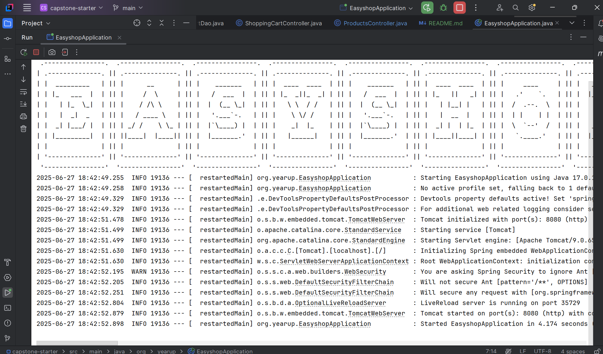
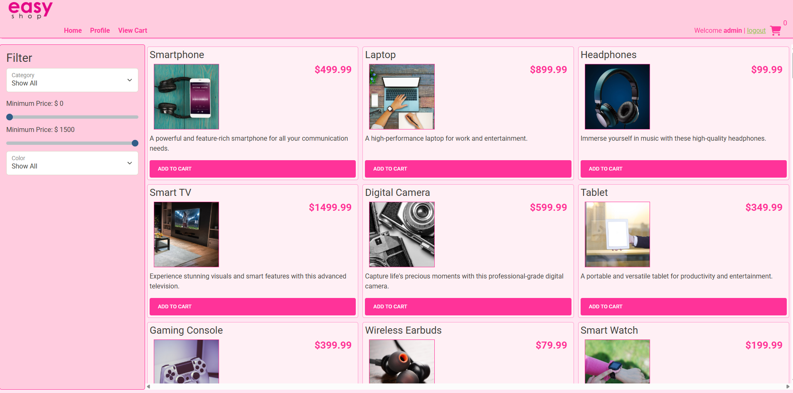
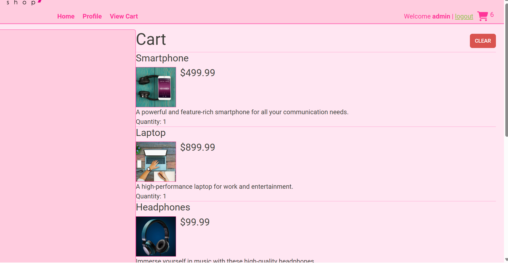
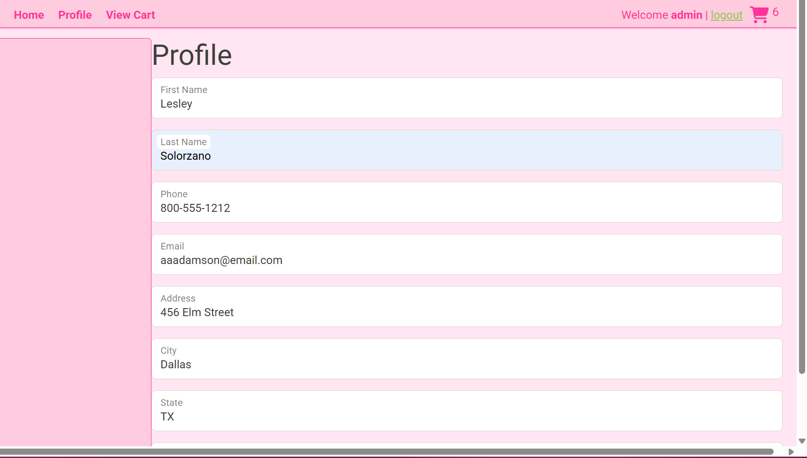

# EasyShop E-Commerce API 🛒

A comprehensive e-commerce REST API built with Spring Boot and Java, providing full backend functionality for an online shopping platform. This project includes user management and profiles, product and category catalog, and shopping cart capabilities.

---

## 📌 Project Overview

This Spring Boot application serves as the backend API for an e-commerce website, handling all server-side operations while the frontend UI remains fully functional. The API provides secure endpoints for product browsing, user authentication, shopping cart management, and profile updates.

---

## 🚀 Features Implemented

### ✅ Core Functionality
- **User Authentication:** Registration and login system with role-based access control
- **Product Management:** Browse products by category with search and filter capabilities
- **Category Management:** Full CRUD operations for product categories *(Admin only)*
- **Shopping Cart:** Persistent cart functionality for logged-in users
- **User Profiles:** Profile management and updates

### ✅ Security Features
- Role-based authorization (`USER`, `ADMIN` roles)
- Admin-only access for category and product management
- Secure user session management
- Protected endpoints for sensitive operations

---

## 🛠 Technical Stack
- **Framework:** Spring Boot
- **Language:** Java
- **Database:** MySQL
- **Security:** Spring Security with role-based access
- **Architecture:** RESTful API
- **Testing:** Postman for API testing, JUnit for unit tests

---

## 📊 API Endpoints Summary

### Authentication 🔒
- `POST /register` — User registration
- `POST /login` — User login

### Categories 📃
- `GET /categories`
- `GET /categories/{id}`
- `POST /categories` *(Admin)*
- `PUT /categories/{id}` *(Admin)*
- `DELETE /categories/{id}` *(Admin)*

### Products 📱
- `GET /products`
- `GET /products/{id}`
- `GET /products/category/{id}`
- `POST /products` *(Admin)*
- `PUT /products/{id}` *(Admin)*
- `DELETE /products/{id}` *(Admin)*

### Shopping Cart 🛒
- `GET /cart`
- `POST /cart/products/{productId}`
- `PUT /cart/products/{productId}`
- `DELETE /cart`

### User Profile 👤
- `GET /profile`
- `PUT /profile`

---

## 🧪 Testing

The API was thoroughly tested using **Postman** to verify functionality of:
- Category CRUD operations
- Product search and filtering
- Shopping cart operations
- User authentication and authorization

Additionally, **JUnit tests** were implemented for selected components.

---

## 📁 Project Structure  

capstone-starter/
├── src/
│ ├── main/java/org/yearup/
│ │ ├── configurations/
│ │ ├── controllers/
│ │ ├── data/
│ │ ├── models/
│ │ ├── security/
│ │ └── EasyshopApplication
│ └── main/resources/
│ └── test/java/org/yearup/
│ ├── configuration/
│ ├── data/mysql/
├── pom.xml
├── README.md

---
## 📸 Screenshots

▶️ **Start Up**  

🏠 **Home Page**  

🛒 **Cart**  

👤 **Profile**  

## 💡 Future Enhancements

- Implement order processing and checkout system
- Add product reviews and ratings
- Wishlist functionality
- Payment integration (e.g. Stripe, PayPal)
- Admin dashboard for analytics

---

## 🤝 Contributing

Contributions are welcome! Fork the repository, create a branch, make your changes, and submit a pull request.

---

## 📜 License

MIT License. See `LICENSE` file for details.
